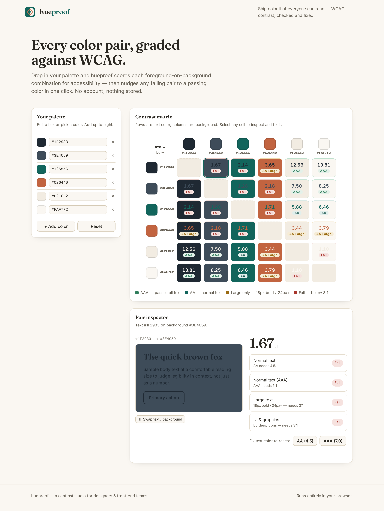

  

<h1 align="center">hueproof</h1>

Every color pair in your palette, graded against WCAG — and fixed in one click.

## What it is

hueproof is a small, focused contrast studio for designers and front-end teams. Paste in your palette and it builds a matrix of every foreground-on-background combination, scoring each one against the WCAG 2.1 contrast thresholds (AAA, AA, AA-Large, or Fail). Pick any pair and the inspector shows a live preview plus a pass/fail breakdown for normal text, large text, and UI elements. If a pair falls short, one click nudges the text color to the nearest shade that passes AA or AAA.

It runs entirely in the browser as a single HTML file. No build step, no account, nothing sent anywhere, nothing stored.

## Who it's for

- Designers auditing a brand palette for accessibility before handoff
- Front-end developers who need a fast contrast check without leaving the browser
- Design-system maintainers documenting which color pairs are safe for text

## How to use

1. Open `index.html` in any modern browser.
2. Edit the starter palette — type a hex, use the color picker, or add up to eight colors.
3. Read the matrix: rows are text color, columns are background. Each cell shows the contrast ratio and grade.
4. Click any cell to open the inspector. Check the live preview and the per-context pass/fail results.
5. If it fails, hit **AA (4.5)** or **AAA (7.0)** to snap the text color to a passing shade, then copy the new hex from the palette.

## Features

- Full contrast matrix for up to eight colors, color-coded by grade
- WCAG 2.1 ratios for normal text, large text, and UI/graphics
- One-click accessible fix that finds the minimal lightness shift to pass
- Live component preview (heading, body, button) for every pair
- Swap text/background to test both directions
- Warm, editorial light theme with AA-compliant UI throughout
- Zero dependencies, single file, fully offline

## License

MIT — original code and artwork, free to use and adapt.
